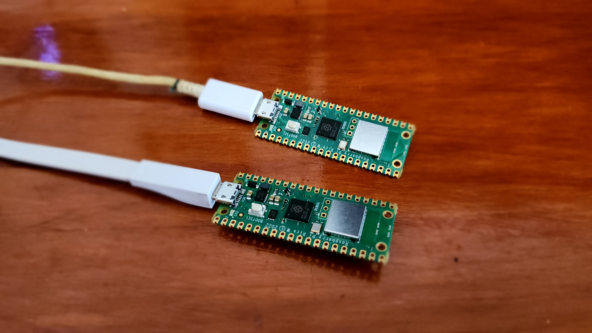
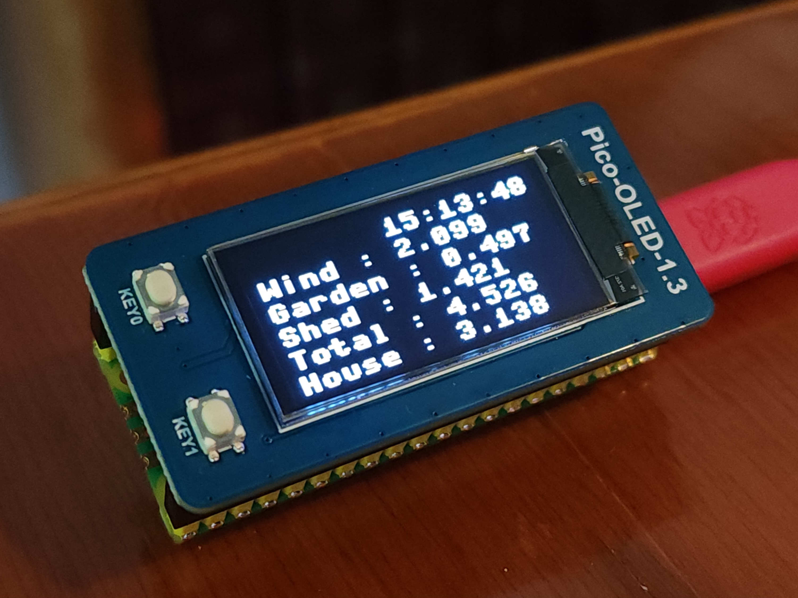
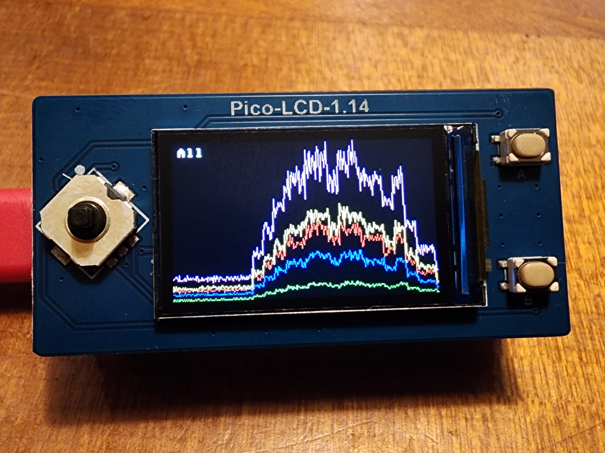

# Meters

Simon Garton  
simon.garton@gmail.com  
[simongarton.com](https://simongarton.com)  

March 2023

## About

This project explores setting up Raspberry Pis to simulate electricity meters, generating realistic daily
profiles of electricity consumption, that can be pushed to an MDMS.

## Current status

After a rainy Saturday of development, and a little bit of tweaking for the Pico, I have the following set up:

- `tempest.py`, a Flask based headend. This manages the various meters, storing the automatically uploaded data (both in JSON and in InfluxDB) and can also be used to upload payloads directly from the meter; and to update config. I _could_ use it to update the code as well.
- `meter.py`, a simple meter simulator. Reads a config file to work out what it should be doing on a regular 5 minute tick (cron job) and may optionally generate and store new data, and optionally upload it to Tempest. Runs well on a Raspberry Pi 3B.
- `meter_pico.py`, a down-graded version of meter.py, which works on a Raspberry Pico W. The environment is quite different - not a "real" computer, you just upload a Python script as `main.py` - and the environment uses MicroPython, which turns out to be quite different.
- [InfluxDB](https://www.influxdata.com/), I've been wanting to evaluate this time series database for some time.

### InfluxDB


Three devices running. Note how one dropped off line for a day; I am finding that the Picos crash frequently, but haven't got
any diagnostics.

### Raspberry Pi 3B

Used as a headend to collect data from the meters; can also collect data itself.


### Raspberry Pico W

Two minimal meters, generating typical data.



### OLED display

Extending the functionality - just for fun - put a little OLED display onto the Pico to see what it's up to. Monocolor, but
bright; 128 x 64 resolution.



### LCD display

Extending the functionality - just for fun - put a little LCD display onto the Pico to see what it's up to. 16 bit color, 240 x 135 resolution.




## Findings

- cute idea, works OK
- working with the Picos and MicroPython is tricky, and code needed to be rewritten.
- Picos seem to hang regularly.
- InfluxDB has a lovely interface; some gotchas about refreshing screens and time zones.

Timezones gave me some trouble. I started working with local time and Python's `datetime` - but the dates I used were not
timezone aware. Loading them into InfluxDB didn't seem to work - no error, just nothing showed up - and I think it was because
I did some 'unusual' conversion to make them timezone aware, which set the hour and minute to be appropriate for NZ, but the timezone was in UTC - which means the actual time is in the future, which doesn't display by default :facepalm.


I'm currently running the devices as though they were in UTC; so I have to make sure to display the data in UTC, otherwise the daily
patterns appear overnight.


### To do

- introduce exceptions (very high readings), and missing data - either failure to upload an entire day, or individual missing readings.
- the snapshots are not rounded to 3 decimals
- there's a minor rounding/formatting issue with the hourly readings

```
            "2023-04-07T11:50:00Z": 0.511,
            "2023-04-07T18:45:00Z": 0.9309999,
            "2023-04-07T18:40:00Z": 1.014,
```            

- support redials

## Getting Started

### Raspberry Pi 3B

You'll need to do some configuration to get it set up. There are two parts : the main meter simulator,
and then a [Flask](https://flask.palletsprojects.com/en/2.2.x/) based agent to handle remote control by Tempest.

- Create a directory called agent in home : `/home/pi/agent`
- Copy the files : `__init__.py`, `agent.py`, `config.json`, `meter.py`, `meter.sh`, `run.sh`
- Copy the `app` directory :` __init__.py` and `routes.py`

And then create the cron jobs. `pytz` is needed as an import.

```
*/1 * * * * sudo /home/pi/agent/meter.sh
@reboot sleep 15; sudo /home/pi/agent/run.sh
```

### Raspberry Pico

You need to install the MicroPython environment : https://www.tomshardware.com/how-to/raspberry-pi-pico-setup

Then copy the content of `meter_pico.py` to `main.py` on the Pico. For wifi, you will also need `secrets.py` ...

```
# needed for Pico on my Wifi

SSID='GoogleWifi'
PASSWORD='my-secret-password'
```

and `config.json`, and you must create the folder `data` (to be fixed.)

There is confusion over the `urequests` library. It's imported in the code; I installed it on `pico` and it's working; 
I forgot to install it on `dori` and it's ... working. Well, it was heartbeating, but I didn't see a file uploaded.
Installed `micropython_urequests` and I now have a file. How did it heartbeat ?

### Tempest

This acts as the head end, plus the asset management system.

- All meters online will ping Tempest every minute as a heartbeat
- Periodically, the meters will upload the previous day - every time the working day changes, they upload the previous one.
- All data is persisted in it's raw JSON format.
- All data is also persisted to InfluxDB.
- Tempest can update their config, and possibly their business logic
- There is a crude API:

```
{{tempest_host}}/
{{tempest_host}}/heartbeats
{{tempest_host}}/meters
{{tempest_host}}/meter?serial=kili
{{tempest_host}}/meter?serial=kili&day=2023-04-02
```

- There is a crude UI:


### Meter (full version)

Several things run on the Pi.

- `agent.py` is invoked on startup. It runs a Flask web server to accept REST calls; it also makes a timed
announcement call to Tempest to say it is on line. I am considering a heartbeat as well.
- a CRON job runs every 5 minutes, on the 5 minute, to invoke `meter.py`
- `meter.py` is invoked every 5 minutes and makes decisions, based on it's config, which is stored in `config.json`
- each cycle it adds a reading, and uploads the current file
- when the working day has changed, it starts writing to a new file.

### Meter (Pico, Micropython)

Several things run on the Pi.

- a single script `main.py` is invoked on startup, and reads it's config, which is stored in `config.json`
- it then loops around, pausing for 5 minutes, and then does the necessary logic.
- each cycle it adds a reading, and uploads the current file
- when the working day has changed, it starts writing to a new file.

## Config

See the `config.json` files in this repo.

The following keys are used:

```
    "interval_min": 5,
    "serial": "mac",
    "tempest_url": "http://192.168.86.34:8002/",
    "profile": {
        "0": 1,
        "1": 2,
        "2": 1,
        ...
    },
    "variability": 0.1,
     "channels": {
        "Total": 1.0,
        "House": 0.8
     }
```

- `interval_min` : self-explanatory, normally 5 or 30 as a number
- `serial` : self-explanatory, serial number as a string.
- `tempest_url` : where is the Tempest head-end to be found
- `profile` : a map, keys are strings 0->23 of base values to use as a profile for the captured data
- `variability` : a float, a measure of how much the readings will differ from the profile. 0.1 is 10% and is a good start
- `channels` : a map of channel names and multipliers


- `display` : `oled-1.3`, `lcd-1.14` or `null` for my supported displays
- `demo` : `true`, `false` or `null` : if `true,` this is a normal pico with no network so no uploads etc
- `model` : `pico` or `pico-w` (different pins)


The `profile` is used to give target readings for each hour; which are then varied by `variability` and also a per-channel factor.