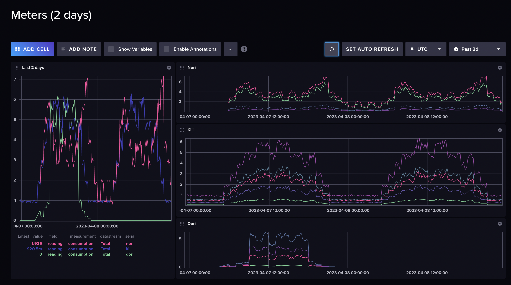

# Meters

Simon Garton  
simon.garton@gmail.com  
[simongarton.com](https://simongarton.com)  

March 2023

## About

This project explores setting up Raspberry Pis to simulate electricity meters, generating realistic daily
profiles of electricity consumption, that can be pushed to an MDMS.

## Current status

After a rainy Saturday of development, and a little bit of tweaking for the Pico, I have the following set up:

- `tempest.py`, a Flask based headend. This manages the various meters, storing the automatically uploaded data (both in JSON and in InfluxDB) and can also be used to upload payloads directly from the meter; and to update config. I _could_ use it to update the code as well.
- `meter.py`, a simple meter simulator. Reads a config file to work out what it should be doing on a regular 5 minute tick (cron job) and may optionally generate and store new data, and optionally upload it to Tempest. Runs well on a Raspberry Pi 3B.
- `meter_pico.py`, a down-graded version of meter.py, which works on a Raspberry Pico W. The environment is quite different - not a "real" computer, you just upload a Python script as `main.py` - and the environment uses MicroPython, which turns out to be quite different.
- [InfluxDB](https://www.influxdata.com/), I've been wanting to evaluate this time series database for some time.

### InfluxDB



Very early results. I need to work on the smoothing algorithm

### Raspberry Pi 3B


### Raspberry Pico W


## Getting Started

### Raspberry Pi 3B

You'll need to do some configuration to get it set up. There are two parts : the main meter simulator,
and then a [Flask](https://flask.palletsprojects.com/en/2.2.x/) based agent to handle remote control by Tempest.

- Create a directory called agent in home : `/home/pi/agent`
- Copy the files : `__init__.py`, `agent.py`, `config.json`, `meter.py`, `meter.sh`, `run.sh`
- Copy the `app` directory :` __init__.py` and `routes.py`

And then create the cron jobs.

```
*/1 * * * * sudo /home/pi/agent/meter.sh
@reboot sleep 15; sudo /home/pi/agent/run.sh
```

### Raspberry Pico

You need to install the MicroPython environment : https://www.tomshardware.com/how-to/raspberry-pi-pico-setup

Then copy the content of `meter_pico.py` to `main.py` on the Pico. For wifi, you will also need `secrets.py` ...

```
# needed for Pico on my Wifi

SSID='GoogleWifi'
PASSWORD='my-secret-password'
```

and `config.json`, and you must create the folder `data` (to be fixed.)

### Tempest

This acts as the head end, plus the asset management system.

- All meters online will ping Tempest every minute as a heartbeat
- Periodically, the meters will upload the previous day - every time the working day changes, they upload the previous one.
- Tempest can update their config, and possibly their business logic
- There is a crude API:

```
{{tempest_host}}/
{{tempest_host}}/heartbeats
{{tempest_host}}/meters
{{tempest_host}}/meter?serial=kili
{{tempest_host}}/meter?serial=kili&day=2023-04-02
```

- There is a crude UI:


### Meter

Several things run on the Pi.

- `agent.py` is invoked on startup. It runs a Flask web server to accept REST calls; it also makes a timed
announcement call to Tempest to say it is on line. I am considering a heartbeat as well.
- a CRON job runs every 5 minutes, on the 5 minute, to invoke `meter.py`
- `meter.py` is invoked every 5 minutes and makes decisions, based on it's config, which is stored in `config.json`

## Config

See the `config.json` files in this repo.